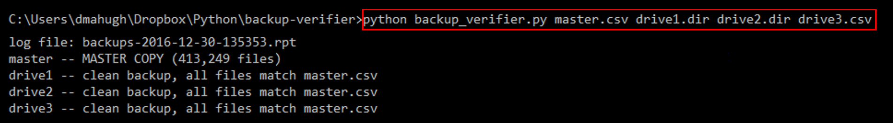

# backup-verifier
This is a tool to identify differences between one or more copies of a backup stream. I use this tool audit my backups occasionally, to verify that they're all 100% in synch with no missing files, extra files, or modified files.

  

# Table of Contents
* [Background](#background)
* [Installation](#installation)
* [Usage](#usage)
* [Contributing](#contributing)
* [License](#license)

# Background
I blogged briefly about this tool [here](http://mahugh.com/2016/12/28/verifying-backup-drives/). It's something I've meant to write for years, because I don't care for the other ways to check differences between directory trees in Windows.

You can find details about my approach to managing my backups [here](http://mahugh.com/2013/04/02/my-backup-process/). I don't recommend my approach for others, because I don't care how you manage your backups and I certainly don't want any responsibility for how well your approach works. For me, though, this works great, and I have a backup stream that contains (among other things) every single photo I've ever taken that I felt was worth keeping, including thousands of photos from pre-digital days and over 300,000 total photos now.

If a cloud backup gives you what you want from life, you should stop reading and just do that instead. :)

# Installation
This program has no external dependencies, so if you have Python 3.5 or later installed you can just clone the repo and then run it with this command:

```python backup-verifier.py <masterdatafile> <backupcopy1> <backupcopy2> ...```

See below for more details on how to use it.

# Usage
This program works off of *captured Windows directory listings*. I did this to make it easy for me to capture a directory listing from a backup drive on any of my machines, whether online or offline. So the basic workflow is like this:

* capture directory listings into .dir files for each of my backup copies; for example, ```c:>dir d:\ /s >drive1.dir```
* run backup-verifier.py to compare these files; results are summarized on the console, and a detailed .rpt log file is also created, listing every difference between the drives

Note that the diff/comparison runs off .csv files, so these are dynamically created from the .dir files if needed. You can specify any combination of .dir files and .csv files on the command line, and any .dir files specified will have same-named .csv files created on the fly if needed. Then you can re-run the comparison from those .csv files if desired. Note that the comparison itself runs pretty fast, it's the parsing of the .dir files that can take a while.

Here's a sample output:



In that example, you can see that two of the sources were passed as .dir files, and two as .csv files. And all copies match the master. That's the goal!

# Contributing
This is a specialized little program that does exactly what I need, but if you'd like to submit a pull requests, note a bug, or comment on anything, feel free to [log an issue](https://github.com/dmahugh/backup-verifier/issues).

# License
This program is licensed under the [MIT License](https://github.com/dmahugh/backup-verifier/blob/master/LICENSE).

Copyright &copy; 2016 by Doug Mahugh
